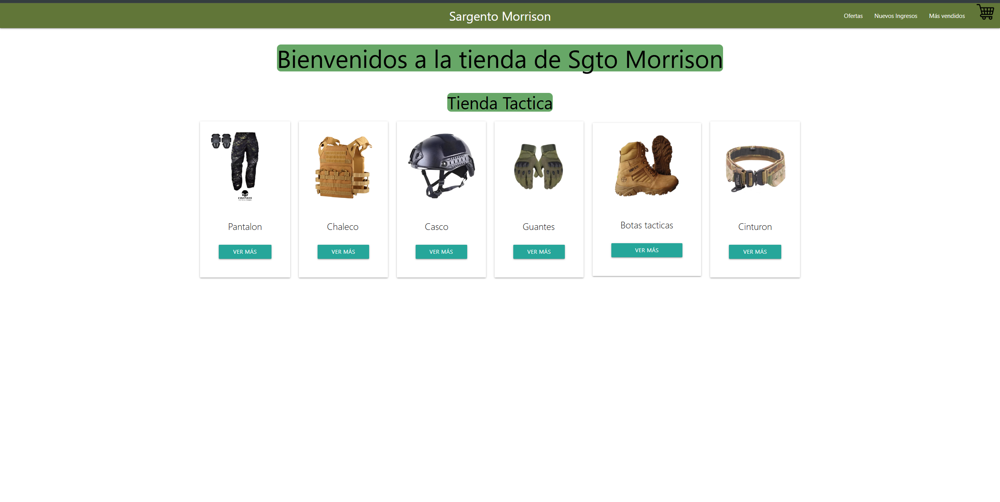

# Sargento Morrison App 🛒

Proyecto e-commerce creado en curso React JS,  para vender artículos tacticos.

### Instalación ⚙

- Clone repositorio
- Ejecute npm install para instalar dependencias y crear carpeta node_modules
- Ejecute npm run dev para levantar en servidor local

# Versíon HOST 

Si desea ver el proyecto online, puede ingresar al siguiente link [Sargento Morrison App](https://sgto-morrison.vercel.app/)

### Líbrerias utilizadas en este proyecto

- [Materialize](https://materializecss.com/getting-started.html): utilizada para dar estilos a la app
- [FireBase](https://firebase.google.com/?hl=es-419): utilizada como base de datos
- [React Router Dom](https://reactrouter.com/): navegación por rutas
- [React Hook Form](https://reactrouter.com/): validación de formularios

# Desarrollado por Gustavo Piña.